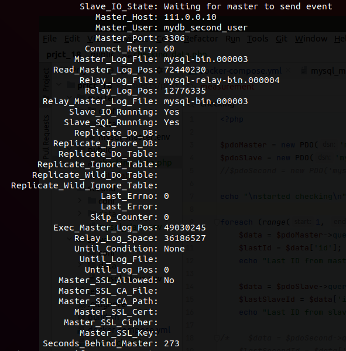
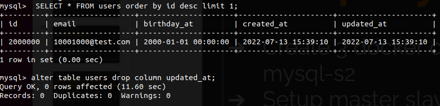
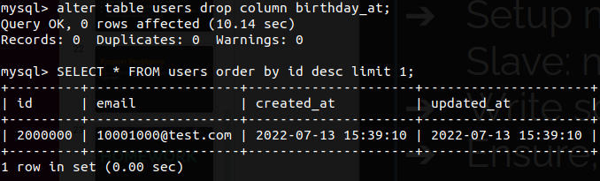

Docker MySQL master-slave replication 
========================

MySQL master-slave replication with using Docker. 

## Run

To run this examples you will need to start containers with "docker-compose" 
and after starting setup replication. See commands inside ./build.sh. 

#### Create 3 MySQL containers with master-slave row-based replication 

```
./build.sh
```

#### Show master status

```
docker exec mysql_master sh -c 'mysql -u root -p111 -e "SHOW MASTER STATUS \G"'
```

#### Show slave status

```
docker exec mysql_slave sh -c 'mysql -u root -p111 -e "SHOW SLAVE STATUS \G"'
```

#### Run init data command

```
php init_data.php
```

#### Run checking data command

```
php checking_data.php 
```

#### Screenshot after stopping one of slave container(showing diff with master)



#### Drop updated_at (last column)



#### Drop birthday_at (medium column)


